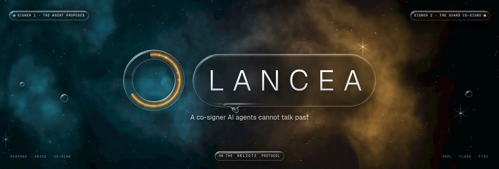
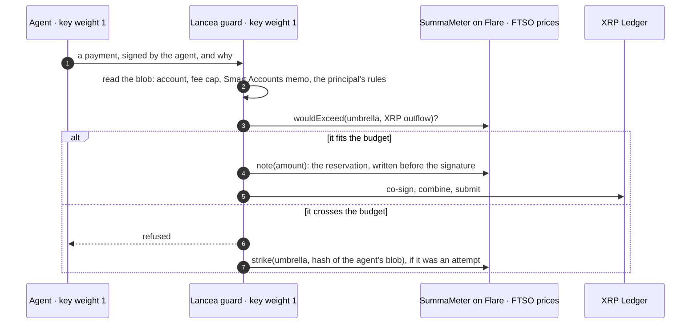

<div align="center">



**A co-signer AI agents cannot talk past.** An agent holds a key to an XRP Ledger account, but only half of what a payment needs. The other half is a guard. The guard prices every payment against its principal's dollar budget on Flare, reads what the payment would do there, and then co-signs or refuses. A steered agent trips its own leash, on every rail at once.

*One dollar budget across XRPL and Flare · priced by the FTSO on DELICTI's SummaMeter · Flare Smart Accounts read before they act · a tripwire that shuts every rail · live 24/7 on a public dashboard*

[](https://github.com/dziuba0x/lancea/actions/workflows/test.yml)
[](https://github.com/dziuba0x/lancea/actions/workflows/watch.yml)
[](https://github.com/dziuba0x/lancea/releases)
[](https://dziuba0x.github.io/lancea/)

[](https://github.com/dziuba0x/delicti)


[](LICENSE)

[**Live demo**](https://dziuba0x.github.io/lancea/) · [The problem](#the-problem) · [How it works](#how-it-works) · [Watch it live](#watch-it-live) · [What the guard checks](#what-the-guard-checks) · [One guard, two ledgers](#one-guard-for-xrpl-and-flare-flare-smart-accounts) · [The drill](#the-drill-a-staged-hijack-and-the-re-arm) · [Quickstart](#quickstart) · [Deployments](#deployments) · [DELICTI](#lancea-and-delicti) · [Limits](#limits-stated-up-front) · [FAQ](#faq)

</div>

---

> **TL;DR** Lancea is an open-source guard, written in TypeScript. It lets an AI agent hold a real XRP Ledger account without being able to spend past what its principal allows. The account's master key is disabled. Its SignerList holds the principal (weight 2), the agent (1) and the guard (1), with quorum 2. Before the guard adds the second signature, it asks [DELICTI](https://github.com/dziuba0x/delicti)'s `SummaMeter` on Flare whether the payment fits the umbrella's dollar budget. The budget spans XRPL and Flare, and the [FTSO](https://dev.flare.network/ftso/overview) prices every amount. The guard also reads Flare Smart Accounts instructions, to see what a payment would do on Flare. When a refusal looks like an attempt, the guard strikes it on-chain. The tripwire then shuts every rail of the umbrella, XRPL and x402 on Flare alike, until the principal re-arms it. On testnets, a live agent runs XRP through a Flare vault and back, around the clock, and [the dashboard](https://dziuba0x.github.io/lancea/) shows every decision.

## The problem

An AI agent with a wallet will be told things. It reads a planted note ("the treasury moved its settlement account"), and then it asks to pay somewhere new, politely and with a good reason. Prompt injection does not need to break the model's weights. It only needs the agent to believe one sentence.

The XRP Ledger has no spending limit to fall back on:
- Permission delegation (XLS-75) is all-or-nothing per transaction type, with no amount limits, and it is not enabled on mainnet.
- A budget kept inside the agent is a budget the agent can be talked out of.
- A budget kept on one chain does not see what the agent spends on another.

Lancea moves the limit out of the agent's reach and across chains: the agent's key is only half a signature.

## How it works

Give an AI agent an XRPL account, disable its master key, and put three keys in its SignerList:

| signer | weight | what it can do |
|---|---|---|
| principal | 2 | everything, alone: recovery never depends on anyone else |
| agent key | 1 | nothing alone |
| **Lancea guard** | 1 | nothing alone; with the agent, exactly what the budget allows |

Quorum 2. The agent proposes a payment and signs it. Before the guard co-signs, it asks DELICTI's `SummaMeter` on Flare one question: *would this take the agent's umbrella past its dollar budget?* The budget counts every rail the agent spends on: XRP on the Ledger, USD₮0 through x402 on Flare. Each amount is priced by Flare's FTSO. If the answer is no, the guard **reserves** the amount on Flare first (the tally records the intent before the act), then signs, combines and submits. If the answer is yes, there is no signature, and the payment cannot happen. The agent's key alone is weight 1 of 2.

The guard can refuse. It cannot move funds. Its failure mode is liveness, never theft, and the principal can always act alone.

This is the XRP Ledger's missing piece. Permission delegation (XLS-75) is all-or-nothing per transaction type: it has no amount limits, and it is not enabled on mainnet. Multisig has existed since 2016. Lancea makes it a spending limit that holds across chains.



### One attempt, every rail (DELICTI amendment v1.2)

A refusal is not only a no. When the refused payment breaks the budget even against the tally of ten minutes ago, at 99 % of its value, it was an **attempt**, not a lost race. The guard then **strikes** the umbrella in `SummaMeter`, with the hash of the agent's own signed blob as evidence.

Once the principal's tripwire is reached (`setTripwire`, one strike if they like), the meter answers *no* to everything, on every rail:
- the guard refuses every XRPL payment;
- DELICTI's x402 facilitator refuses every payment on Flare.

It stays that way until the principal looks and re-arms. It works in reverse too: an attempt recorded on Flare (`MandateFacilitator.recordAttempt`) trips the guard here without a line of Lancea code, because both ask the same meter.

**Status:** live end to end on DELICTI's deployed `SummaMeter` v1.2, [`0x39aa9b12…1FaB1D`](https://coston2-explorer.flare.network/address/0x39aa9b12CDe7bFc936456247DFb3eb78aA1FaB1D), source verified: the same meter every rail of an umbrella asks. Last run 2026-09-27 (XRPL testnet + Coston2): 6 of 6 decisions as designed. The runs are in [docs/runs.md](docs/runs.md). Against a meter from before v1.2, the guard refuses exactly as before and strikes nothing.

## Watch it live

**[dziuba0x.github.io/lancea](https://dziuba0x.github.io/lancea/)**. A live agent works a guarded account on XRPL testnet and Flare Coston2, 24/7, from a small cloud machine. It looks at the account every 5 minutes and runs its XRP round a wheel, one co-signed step at a time:

1. It starts a withdrawal from the Firelight vault once each vault period.
2. It claims the withdrawal when it unlocks.
3. It redeems the FXRP to XRP.
4. It mints the XRP to FXRP again and deposits it again.

Each step is an XRPL payment that the guard prices and co-signs, on a $30 000 umbrella that runs 60 days. That is about 140 decisions a day. Nothing on the page is staged. The feed is the services' own journals and a fresh read of both chains, pushed every minute. A GitHub Actions [watchman](.github/workflows/watch.yml) reads the feed every half hour and raises the alarm when the demo needs a hand.

[dziuba0x.github.io/lancea](https://dziuba0x.github.io/lancea/) is the demo, live. It reads `feed.json` from the demo machine every minute. When the feed cannot be reached, it shows a dated snapshot and says so. When the machine has published nothing for 30 minutes, it says it is offline.

Five views:

- **Now:** the state in one sentence, and the budget as a glass ring. Its amber liquid is the dollar budget spent across every rail. Inside the ring, every co-signed step is a white star, arranged in a spiral around the point where the two witnesses meet. **Replay** steps back through the decisions one by one: the ring, the stars, the figure and the list show that moment. The view also has the balances with their history, the latest decisions, and a countdown to the agent's next look.
- **Timeline:** every decision and note, by day, with filters and search. A decision opens in a sheet with the decoded transaction, the price and each hash on its explorer. A right click (or a long press) opens a menu: copy the hash, open the explorer.
- **Budget:** spend over time against the budget, a table view, the pace, what the budget paid for, and XRP as FTSO priced each mint.
- **Keys:** who can move the money. Choose signers and see what can happen. It also shows each key, its explorer link and the guard's gas.
- **How it works:** the flow from the agent's claim to the guard's verdict, for a first-time visitor.

The status capsule is an island: when a decision arrives while you watch, it opens to say what happened, and a tap pours that decision's sheet out of it. Keys: `1`–`5` switch views, `/` searches, `Esc` closes.

Every decision has two witnesses:

- **Agent said** (cyan): the agent's own words.
- **Transaction does** (amber): read by the guard from the signed transaction.

White marks a co-signature. Coral marks a refusal or a strike.

The page is one file, built by `scripts/dashboard-build.ts` into `docs/index.html` from `dashboard/`:

- `page.html` holds the markup;
- `style.css` holds the styles;
- `app.js` holds the views;
- `glass.js` draws the sky and the glass.

`glass.js` is a WebGL2 renderer in two passes, the recipe of the DELICTI hero, running live:

1. **The sky, drawn into a texture with mipmaps.** It has a nebula lit by the two witnesses, three layers of stars, a few JWST spikes, meteors, a satellite, a pulsar, a far galaxy and the decisions. When a new co-signature arrives, cyan and amber light meet at the white star, and a new star is born there.
2. **The glass, drawn from the page's own geometry.** Its shape is a squircle bevel. It refracts each colour channel separately (IOR 1.44 / 1.50 / 1.57) and has a weak Fresnel term. A light that moves travels around each rim, and the pointer is a second light. The soft shadow shows through the glass too. Glass appears by gaining its lensing, not by fading. Drops merge with Apple's neck.

The glass moves like a liquid, on SwiftUI's springs (`Spring(duration:bounce:)`):

- **Two layers, never glass on glass.** The page's glass is one layer. The sheet, the menu and the toast are an overlay above it, which casts its shadow on the page and never merges with it.
- **Matched geometry.** A sheet grows out of the row, the star or the island it describes, with a liquid neck to a drop left behind, and flows back into it when it closes.
- **Flow between views.** The panes of one view flow into the layout of the next: a pane divides where the new view has more, and panes merge where it has fewer. In flight they blend like glass in a GlassEffectContainer and part as they slow down; the new words land with their glass.
- **Interactive glass.** Under a finger the glass swells and lights up from the point of touch, then springs back. A tab or a filter can be pressed and dragged: its lens lifts out of the bar as a clear drop and settles on the nearest choice.
- **The pointer's drop.** It stretches as it moves, wobbles when it stops, sheds two droplets when flung and focuses a caustic on the sky. Over a control it sinks into the glass and becomes that control's highlight.

It respects reduced motion (a still sky, no flow) and reduced transparency (solid panes). Without WebGL2 it falls back to CSS glass.

## What the guard checks

In order, on every payment. Any failure is a refusal, and a refusal is never a crash.

| check | read from | on failure |
|---|---|---|
| an XRP `Payment` from the guarded account | the agent's signed blob | refused |
| the fee is at most 0.01 XRP (a fee is outflow too) | the blob | refused |
| a Smart Accounts payment does what the principal allows: an allowed vault, a mint to its own personal account, no destination tag | the memo, decoded (`src/smart-accounts.ts`) | refused; struck when the principal opts in |
| the umbrella's dollar budget, across every rail, at the FTSO price | `SummaMeter.wouldExceed` on Flare | refused; struck when it was an attempt |
| the principal's rules: an hourly cap across rails, cooling for new payees | `spentAt` history, `account_tx` | refused; struck when the principal opts in |
| the umbrella is not tripped | `SummaMeter.tripped` | refused |
| the reservation lands on Flare before the signature exists | `SummaMeter.note` | nothing signed |

## The principal's rules

Two rules on top of the budget (`src/policy.ts`). They only ever refuse more, and both work against the DELICTI contracts live today.

- **An hourly cap across every rail** (`policy.hourlyCapUsd6`). It is read from `SummaMeter`'s own history (`spentAt`), so an x402 payment on Flare counts against an XRPL payment here.
- **New-payee cooling** (`policy.newPayeeCapUsd6`, `coolingS` with a 24 h default, `knownPayees`).
  - A destination this account has not paid for at least the cooling period gets at most the cap in total until it cools. Splitting does not reset it.
  - An agent steered into paying someone it never paid before meets this rule first.
  - With `strikeOnPolicy: true`, such a refusal is also a strike. With a tripwire of 1, it freezes the agent on every rail.
- **Where the payee history comes from:** the node's `account_tx`, plus every payment this guard co-signed itself.
  - Measured 2026-09-26: `testnet.xrpl-labs.com` keeps about 1,600 ledgers, roughly an hour and a half. On a node like that, the guard's own memory carries the rule.
  - After a restart, a payee paid before the node's range looks new again. That refuses more, never less.
  - Use a full-history node in production.

`npm test` runs the rules offline: 5 tests of these rules (18 in all), with no network needed.

## One guard for XRPL and Flare (Flare Smart Accounts)

[Flare Smart Accounts](https://dev.flare.network/smart-accounts/overview) give every XRPL address a personal account on Flare. An XRPL `Payment` drives it:
- **deposits, redemptions and claims** in Firelight and Upshift vaults;
- **FXRP transfers and redemptions**;
- **arbitrary calls**, as a user operation.

Flare's docs put it plainly: *"Authorization comes from the XRPL Payment signature itself."* On a guarded account that signature needs the guard, so **every action the agent takes on Flare passes through the guard too**. One co-signer covers the agent's whole footprint on both ledgers.

**Measured on 2026-09-26** (XRPL testnet and Coston2, `npx tsx scripts/sa-multisig-e2e.ts`):
1. A fresh account `raS5RMnwDhZ4bb4mGwNZgbwzb92bhcbPtH` was set up with SignerList 2/1/1 and the master key disabled.
2. The agent alone sent an instruction to the operator (`rEyj8nsHLdgt79KJWzXR5BgF7ZbaohbXwq`): `tefBAD_QUORUM`.
3. Agent and guard together sent it: `tesSUCCESS`.
4. **86 seconds later** the operator had proven the payment with the FDC and called `executeInstruction` for this account on Coston2 ([`0xc93b9809…4706d`](https://coston2-explorer.flare.network/tx/0xc93b980935ab5c515a973597043ae0d37b9be01844b29894eb1f707ad234706d)).
5. The controller reverted `ValueZero()`, because the test moved 0 FXRP: the only instruction that needs no balance. A multi-signed account is relayed and proven like any other. A full success needs FXRP minted first.

**And the full loop, the same day** (`npx tsx scripts/sa-guarded-deposit.ts`). The guarded account is `rGGLyoSLJpg5MFzQCLhx6xb6mz8TCUwCCn`. Every step was vetted by `Guard.smartAccountVerdict`:

| step | what the agent asked | guard | on-chain |
|---|---|---|---|
| — | Core Vault, FAssets memo minting to `0x…bEEF` | **refused**: *an FAssets memo would mint FXRP to 0x…beef* | nothing signed |
| 1 | Core Vault, 20 XRP, memo minting to its own personal account | co-signed | XRPL `470E5F41…0DF43E`; Coston2 [`0x0579dd34…88229b`](https://coston2-explorer.flare.network/tx/0x0579dd3447baf8c87c4b9a7ad21c550d951c749053968e782dc916203188229b): **19.8 FXRP** to `0x678ee1C6…9e4902`, ~2 min |
| — | operator, deposit into Upshift vault 4 | **refused**: *upshift vault 4 is not an allowed vault* | nothing signed |
| 2 | operator, deposit 19 FXRP into Firelight vault 1 | co-signed | XRPL `B45E2ED8…BC2E7E`; Coston2 [`0x8e123383…dda4f0e`](https://coston2-explorer.flare.network/tx/0x8e12338305d0e7e0e3a403c7e00f801ba4bf5f1f11ba04b080e258e20dda4f0e): **18.985959 stXRP**, ~1.5 min |

XRP went to FXRP and then to Firelight, with every step co-signed. The two off-policy requests were never signed. The dollar budget and the tripwire were left out of this run, because they need a Flare key for `SummaMeter`.

**What the guard reads** (`src/smart-accounts.ts`, pure):
- **To an operator:** the 32-byte instruction.
  - Deposit, redeem and claim are allowed only in the principal's vaults.
  - FXRP transfers are allowed only to listed addresses.
  - FXRP redemption is allowed, because it returns XRP to this account.
- **To the FAssets Core Vault:** the minting memo.
  - For user operations (`0xFF` inline, or `0xFE` with the operation shown: `cosign(blob, userOp)`), every call is decoded and must be a listed target and selector, with no FLR attached.
  - Recovery opcodes are allowed. Pinning an executor is the principal's call.
- **The trap an allowlist of destinations would miss:** the Core Vault also mints FXRP to any Flare address named in an FAssets recipient memo (`0x4642505266410018…`), and to whoever holds a destination tag.
  - "May pay the Core Vault" would mean "may pay anyone". The guard refuses both, except a memo that mints to the account's own personal account.
  - One memo per payment, and no destination tag.

```ts
smartAccounts: {
  operators: ["rEyj8nsHLdgt79KJWzXR5BgF7ZbaohbXwq"],       // MasterAccountController.getXrplProviderWallets()
  coreVault: "r…",                                          // AssetManager.directMintingPaymentAddress()
  policy: { vaults: [1], calls: [/* { target, selector } */], personalAccount: "0x…" },
}
```

The decoder and policy have 6 offline tests, built from the vectors in Flare's docs and from the live run.

### The autopilot (`src/autopilot.ts`)

An agent that puts idle XRP to work, one step at a time, and never holds the keys alone. It only **proposes** XRPL payments. The guard reads each one, prices it against the umbrella's dollar budget, and co-signs or refuses. The guard needs no autopilot-specific code.

The order of steps: first any withdrawal the principal asked for, then deposit whole FXRP into the target vault, then mint idle XRP above the reserve. Each mint is capped per step.

**The wheel** (`strategy.loopLots`). With it on, the same coins go round, so the account stays busy on a small float:

1. Once each vault period, the agent starts withdrawing `loopLots` FAssets lots' worth of FXRP from Firelight (`0x12`). Firelight burns the shares and books the FXRP under the next period.
2. When that period has ended, the agent claims it back into the personal account (`0x13`, value = the period).
3. A lot or more of FXRP is redeemed to XRP on the ledger (`0x02`, value = lots). FAssets agents pay the XRP out.
4. That XRP is minted again and deposited again.

Mints stay below a lot, so FXRP from a mint goes to the vault and FXRP from a claim goes home. On Coston2 a period is 4 hours and a lot is 10 FXRP.

Every step is still an XRPL payment the guard prices and co-signs. A step of the wheel that Flare does not execute in time rests for `autopilot.cooldownS` (default 6 h) instead of being proposed again.

`scripts/leash-live.ts` runs it live with the dollar budget and the tripwire:
1. It opens a $40 umbrella in DELICTI's VaultSumma v0.16, on the deployed `SummaMeter` v1.2 (override with `SUMMA_METER`), with tripwire 1.
2. The autopilot mints and deposits.
3. A steered agent tries to mint to a stranger: refused and struck, so the umbrella trips.
4. A legitimate redeem is refused while tripped, and co-signed after the principal re-arms.
5. A mint past $40 is refused.

The guard also caps the transaction fee (`maxFeeDrops`, default 0.01 XRP), because a fee is outflow too.

### Failing closed

The first live run of `leash-live.ts` got as far as the re-arm, then stopped (the rerun with this fix went through all seven steps: see below). The guard's Flare key held 0.5 C2FLR. On Coston2, a write must hold its gas at 2 × base fee + tip up front, about 0.3 C2FLR. So the fourth write could not be paid for (*gas required exceeds allowance*), the guard threw, and the run died.

Every Flare read and write in the guard now fails closed:
- **No reservation, no signature.** A `note` that fails is a refusal.
- **An unreadable meter or policy** is a refusal.
- **A strike that does not land is kept.** The guard signs nothing until it lands, or until the umbrella trips anyway.

`test/guard.test.ts` replays the live failure against a mock Coston2 node. The old guard throws the same error; the new one refuses.

**The live script:**
- funds the guard's key from the day's fee and tops it up before every step;
- writes the run's keys to `.run/` (git-ignored) before anything is funded;
- sends what is left back to the principal at the end;
- logs a failed step and goes on to its summary.

`--sweep .run/<file>` recovers a run that was killed.

**Rehearsing at Coston2's fees.** The earlier rehearsals ran on a bare fork, where gas is nearly free. `scripts/coston2-fork-proxy.mjs` puts Coston2's fee rules in front of an anvil fork: the base fee is held, and `eth_fillTransaction` is capped by the balance. On the fork the script also acts as Coston2's executor, so a rehearsal makes the same writes as the live run.
- With 0.5 C2FLR, the rehearsal fails at the same step as the live run, now as a refusal.
- With today's funding, all seven steps behave as designed, including through a 3× fee spike.

## The drill: a staged hijack, and the re-arm

`scripts/drill.ts` does what a hijacked or prompt-injected agent would. It uses the agent's own key and the services' token to ask the running guard to co-sign a 5 XRP mint, and gives a planted note as its reason. The memo of that mint names a stranger as the recipient. The expected outcome:

1. The guard reads the memo itself and refuses.
2. It writes a strike on Flare, which trips the umbrella (tripwire 1).
3. The autopilot pauses on its next tick.
4. The dashboard reads "The leash held." and says it was a drill.

Nothing can move either way: the agent's signature alone is weight 1 of the 2 the account needs.

`scripts/rearm.ts` is the principal's re-arm. It needs the key that committed the umbrella; any other key reads `NotPrincipal`. The autopilot resumes by itself.

```bash
LANCEA_CONFIG=~/.config/lancea/config.json LANCEA_KEYS=~/.config/lancea/keys npx tsx scripts/drill.ts
set -a; . ./.env; set +a; LANCEA_CONFIG=~/.config/lancea/config.json npx tsx scripts/rearm.ts
```

## Quickstart

```sh
git clone https://github.com/dziuba0x/lancea && cd lancea
npm ci
npm test        # 39 tests, offline: the guard, its rules, Smart Accounts, the autopilot and its wheel, the services, the dashboard
```

The live scripts need a Coston2 key with C2FLR, and DELICTI's build for the full ABIs. The services do not need either: they carry the few ABIs they call (`src/flare.ts`).

```sh
npm ci
PRIVATE_KEY=0x…   # a Coston2 key with C2FLR (principal and gas)
DELICTI_OUT=../delicti/out/ npx tsx scripts/live.ts         # needs `forge build` in the delicti repo
DELICTI_OUT=../delicti/out/ npx tsx scripts/leash-live.ts   # the autopilot on a leash: ≥6 C2FLR, about 1 spent
```

It talks to the XRP Ledger over plain JSON-RPC (`src/xrpl-http.ts`), because websockets are not available everywhere. Signing and encoding are offline, done by xrpl.js.

### Run it 24/7: the guard and the autopilot as services

Two processes, two sets of keys, one machine (`src/service/`):

- **`lancea-guard`** holds the guard's XRPL key and its Flare key. It answers one question, on the machine's loopback and only to the holder of a token: *will you co-sign this?* It reads the agent's blob itself, and it serves one request at a time, so a reservation, a signature and a strike never interleave.
- **`lancea-autopilot`** holds the agent's key, which is below the account's quorum. Each tick it looks at the account, asks its brain (`src/brain.ts`) for one step and why, and sends the step to the guard. The rules:
  - A co-signed step is in flight until the chain shows it.
  - A step its own budget would refuse is held, not proposed. An agent that keeps proposing what the budget refuses would, ten minutes on, be struck for an attempt and trip its own umbrella.
  - A refusal backs off.
  - A tripped umbrella pauses it until the principal re-arms it.
  - **Pacing.** Every co-signature costs the guard gas on Flare, about 0.12 C2FLR for the reservation (`note`). Below 25 C2FLR the agent asks at most once every 15 minutes. Below 5 C2FLR it asks nothing, so the guard always keeps enough to strike. The thresholds are in `pacing`.
  - **Keeper** (testnet only). When everything the account holds falls below `keeper.targetDrops` (XRP, FXRP, shares, withdrawals on their way), the XRPL testnet faucet tops it up with `keeper.refillDrops`, at most once every `keeper.everyS`. An inflow needs no signature, so the guard is not asked.
- **Journals.** Both processes append to journals (`guard.jsonl`, `autopilot.jsonl`). The guard's entry puts what the agent *said* it was doing next to what the transaction *does*, and the verdict.
- **`lancea-feed`** holds no signing key. Every minute it builds `feed.json` from the journals and the chains' state, and pushes it to a GitHub repo ([`dziuba0x/lancea-feed`](https://github.com/dziuba0x/lancea-feed)). Its deploy key can write to that one repo only. The machine opens no port.

**The live demo** runs on an Oracle Cloud Always Free ARM machine (Ubuntu 24.04) as user services, and publishes to the dashboard every minute.

**Watching it.** A GitHub Actions workflow (`.github/workflows/watch.yml`, `scripts/watch.mjs`) reads the public feed every half hour and fails, so GitHub emails the owner, when any of these holds:
- the feed is older than 30 minutes;
- the guard has less than 10 C2FLR;
- the umbrella tripped;
- 90% of the budget is spent, or fewer than 5 days of its window are left.

**A bigger leash.** An umbrella's budget is fixed when it is committed. `scripts/umbrella.ts` has the principal open a new umbrella for the running account: same account, agent and guard; new budget and window. It then updates the config in place.

Setup, on a fresh Debian 12 machine (a Google Cloud e2-micro is enough) and on the principal's own machine:

```sh
# on the services' machine: Node 22, /opt/lancea, the keys made there, the systemd units
curl -fsSL https://raw.githubusercontent.com/dziuba0x/lancea/main/deploy/bootstrap.sh | bash
# on the principal's machine, with the public half it printed: the XRPL account and its SignerList,
# the umbrella, the effector, the tripwire, the gas; it writes lancea.config.json (no keys in it)
PRIVATE_KEY=0x… npx tsx scripts/provision.ts --keys keys-public.json
# back on the services' machine
sudo cp lancea.config.json /etc/lancea/config.json && sudo systemctl enable --now lancea-guard lancea-autopilot
```

**Rehearsed on 2026-09-27** (XRPL testnet, Coston2 fork, umbrella #30):
1. The services acknowledged the umbrella.
2. They co-signed the first mint (20 XRP).
3. They held the next one, which the $40 budget would have crossed ($12.18 more).
4. A request signed by the agent's key, as if a feed had steered it to mint to `0x…bEEF`, went straight to the guard's API. The guard refused it and struck the umbrella (the smart-account rule).
5. The autopilot's next tick paused.

**Testnet only, stated plainly.** On one machine, the guard's key and the agent's key together make a quorum. With real funds the guard runs apart: in a TEE (Flare Confidential Compute), or as an on-chain gate over a Protocol Managed Wallet.

## Deployments

Everything below is on public testnets and can be opened in an explorer.

| what | where |
|---|---|
| DELICTI `SummaMeter` v1.2 (the budget, the tripwire) | Coston2 [`0x39aa9b12CDe7bFc936456247DFb3eb78aA1FaB1D`](https://coston2-explorer.flare.network/address/0x39aa9b12CDe7bFc936456247DFb3eb78aA1FaB1D) |
| DELICTI `MandateRegistry` (umbrellas) | Coston2 [`0x2c58fb0504377fef325DceB66219bC6302263AA3`](https://coston2-explorer.flare.network/address/0x2c58fb0504377fef325DceB66219bC6302263AA3) |
| DELICTI `VaultSumma` v0.16 (the bond) | Coston2 [`0x274e8aa149C0904E10b99c79017EB7EE74184E54`](https://coston2-explorer.flare.network/address/0x274e8aa149C0904E10b99c79017EB7EE74184E54) |
| Flare Smart Accounts `MasterAccountController` | Coston2 [`0x434936d47503353f06750Db1A444DBDC5F0AD37c`](https://coston2-explorer.flare.network/address/0x434936d47503353f06750Db1A444DBDC5F0AD37c) |
| FAssets `AssetManager` (FXRP) | Coston2 [`0xc1Ca88b937d0b528842F95d5731ffB586f4fbDFA`](https://coston2-explorer.flare.network/address/0xc1Ca88b937d0b528842F95d5731ffB586f4fbDFA) |
| Firelight vault (id 1) | Coston2 [`0xC90D6847747b85d1fa2E07859869fb9fB72c0361`](https://coston2-explorer.flare.network/address/0xC90D6847747b85d1fa2E07859869fb9fB72c0361) |
| the demo's guarded account | XRPL testnet [`rhtCafinfGVX6QZQYDGztLFL8qNt5LWcTn`](https://testnet.xrpl.org/accounts/rhtCafinfGVX6QZQYDGztLFL8qNt5LWcTn) |
| its personal account on Flare | Coston2 [`0x953E5e9DAC303918fCa12e2a67743ae2157e04F5`](https://coston2-explorer.flare.network/address/0x953E5e9DAC303918fCa12e2a67743ae2157e04F5) |
| the guard | XRPL [`rG3maSxmDjLLXTQJXLi1jz1mPqNoFffsJw`](https://testnet.xrpl.org/accounts/rG3maSxmDjLLXTQJXLi1jz1mPqNoFffsJw) · Coston2 [`0x676359c706C9CF2931f6A9B8bF4b4CaaBA8b5Db6`](https://coston2-explorer.flare.network/address/0x676359c706C9CF2931f6A9B8bF4b4CaaBA8b5Db6) (its gas) |
| the agent | XRPL [`rPWDAWM1MUPPoaLiePm6yRp66HH18Uo7qq`](https://testnet.xrpl.org/accounts/rPWDAWM1MUPPoaLiePm6yRp66HH18Uo7qq) · Coston2 [`0xCD0C9af54aad6BAAb4c4dA261006106C5F049772`](https://coston2-explorer.flare.network/address/0xCD0C9af54aad6BAAb4c4dA261006106C5F049772) |
| the umbrella | #31: $30 000, 60 days, tripwire 1 |
| the feed | [`dziuba0x/lancea-feed`](https://github.com/dziuba0x/lancea-feed), one commit, replaced every minute |
| the dashboard | [dziuba0x.github.io/lancea](https://dziuba0x.github.io/lancea/) (GitHub Pages, `docs/`) |

## Lancea and DELICTI

[DELICTI](https://github.com/dziuba0x/delicti) is the protocol: accountability for autonomous AI agents. A principal commits a mandate, and an independent witness confirms each deed. When the agent breaks the mandate, its bond pays. DELICTI's SUMMA extension turns umbrellas into dollar budgets that span rails. Its `SummaMeter` prices every amount with the FTSO and keeps the tally. Amendment v1.2 adds the tripwire.

Lancea is the first product built on it. DELICTI proves what an agent did, after the act, from the chains' own evidence. Lancea stops what an agent should not do, before the act, with half of every signature. Both ask the same meter, so a strike on one rail trips the other. They share a design language: two lights meeting in a white star, cyan for the one who proposes and amber for the one who checks, set in clear liquid glass.

## Limits, stated up front

- **Testnets only, unaudited.** Nothing here should hold real money yet.
- **XRP `Payment`s only.** Issued currencies (RLUSD) are outside DELICTI's evidence today: the FDC's `Payment` type attests native payments only.
- **One guard, and its key is local.** The design allows *k of n* independent guards, each with a bond. XRPL SignerLists hold up to 32 signers, so no single guard can block or collude. The key is meant to move into a Flare Confidential Compute machine: TEE identities are secp256k1, which the XRP Ledger accepts as a signer.
- **The guard's gas is real.** Every co-signature writes a reservation on Flare, at about 0.12 C2FLR. The agent slows down, and then stops, before the guard runs out of gas. Someone still has to top it up.
- **A brake, not yet a verdict.** Linking the account's XRP-outflow mandate to the umbrella (DELICTI §6.10 + SUMMA) would convict even a compromised guard from FDC proofs. That link is not live yet.
- **The autopilot's brain is rules today.** A model that proposes, checked by the same rules (M2), comes next.

## Roadmap

- **M2: an AI brain.** A model proposes each step and explains it, and the rules check every proposal. A prompt-injection drill against the model itself follows.
- **x402 on Flare** under the same umbrella, so one budget covers both an agent's API bills and its treasury.
- ***k of n* guards with bonds**, and the guard's key in Flare Confidential Compute.
- **A Xaman xApp** as the principal's front end.
- **Mainnet** after an audit.

## FAQ

**Can the guard steal?** No. Its key is weight 1 of quorum 2, so it can only add the second signature to a payment the agent already signed. At worst it refuses: the failure mode is liveness, never theft.

**What if the guard is down, or wrong?** The principal holds weight 2 and can always act alone: recover, rotate keys, or remove the guard.

**Why Flare?** It is the one place with prices (the FTSO), proofs from other chains (the FDC) and a bridge for the XRP Ledger's own users (FAssets, Smart Accounts), all built into the protocol. A budget that holds across XRPL and Flare needs all three.

**Is the dashboard real?** Yes. It reads a feed the demo server publishes every minute from its own journals and a fresh read of both chains. Every row links to its transactions.

**What does the demo cost to run?** Nothing but testnet tokens. It runs on an Oracle Cloud Always Free machine. The XRPL testnet faucet keeps the account topped up, and the guard's C2FLR comes from the Coston2 faucet.

## Documents

- [docs/runs.md](docs/runs.md): the live runs, with every transaction.
- [SECURITY.md](SECURITY.md) · [CONTRIBUTING.md](CONTRIBUTING.md) · [CITATION.cff](CITATION.cff) · [llms.txt](llms.txt).
- DELICTI: [README](https://github.com/dziuba0x/delicti) · [SPEC](https://github.com/dziuba0x/delicti/blob/main/SPEC.md).
- The hero is drawn by the dashboard's own glass (`assets/hero/hero.html`) and filmed by `scripts/hero.mjs`.

## Citing

See [CITATION.cff](CITATION.cff), or GitHub's *Cite this repository*.

## License

MIT. Testnets only. Unaudited.
